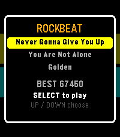
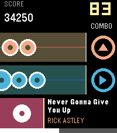
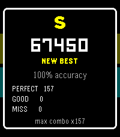
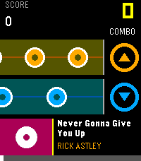

# Rockbeat

A Taiko-style rhythm game for the Pebble Time 2.

| Pick a song | Play | Results |
|:---:|:---:|:---:|
|  |  |  |



Captured on the emery emulator at 200x228, the watch's real size. Note that
**it does not report colours faithfully** — #555500 comes back as #564E36 — so
these read warmer and flatter than the watch does. See "Verifying a change".

Horizontal lanes are stacked to match the physical buttons down the right edge
of the watch. Notes ("pebbles") scroll left to right toward a fixed
hit target beside the buttons; press that lane's button as a note arrives.

```
  TOP lane    ->  UP button       (orange, badge points UP)
  BOTTOM lane ->  SELECT button   (blue,   badge points RIGHT)
  DOWN        ->  menus only; never a lane
  BACK        ->  pause / exit    (never used for gameplay)
```

Two lanes rather than three: it is easier to play, and it turns the game into a
two-handed alternation. See "Which buttons are the lanes" below — the answer has
changed twice, and the reasoning matters more than the answer.

Hits are judged Perfect / Good / Miss on timing accuracy, with a running score
and combo counter.

## Requirements

- **emery** — Pebble Time 2, 200x228, 64 colours. This is the only target
  platform; see "Platform" below.
- Pebble SDK 4.17 with pebble-tool 5.0.39 or newer.

Verify the toolchain with:

```bash
pebble --version          # expect: Pebble Tool v5.0.39 (active SDK: v4.17)
```

## Building and running

All `pebble` commands must be run from `watch/` — the tool fails elsewhere.

```bash
cd watch

pebble build                              # builds for emery
pebble install --emulator emery           # launches the emulator and installs

pebble screenshot --emulator emery --no-open shot.png
pebble logs --emulator emery
pebble kill                               # stop the emulator
```

`pebble clean` is required after editing `package.json`.

Note this tool version does **not** accept `--scale`. Add `--vnc` in a headless
environment — but be aware that disables emulator audio (see below).

**Waf's dependency tracking is not reliable here.** A build can report success
having rebuilt nothing, leaving a stale `.pbw` that then installs cleanly — which
looks exactly like a code change having no effect. If a change does not appear on
the emulator, run `pebble clean` before concluding anything about the code.

## Testing

The judgment windows, scoring and combo logic are unit-tested on the host, with
no emulator involved:

```bash
./tools/run_tests.sh      # expect: OK: 3484 checks passed
```

This works because `game.c` and `chart.c` do not include `<pebble.h>` — they are
compiled with the system `cc`. Keep it that way; it is the fastest way to catch a
timing regression, and it is why `game_judge_hit()` returns a judgment instead of
firing sound and haptics itself.

## How the timing works

The authoritative clock is the game's own timeline: elapsed milliseconds since
the song started. Every note's on-screen x position derives from
`(note.hit_time_ms - elapsed_ms)`, and scoring compares the button-press
timestamp to `note.hit_time_ms`.

Sound and vibration are fire-and-forget **outputs** triggered by judged events.
The timing and scoring loop never reads audio state, so the game stays perfectly
playable and correctly scored with sound muted, disabled, or absent — and is
immune to speaker latency.

The frame rate does not bound timing precision either. Press timestamps are taken
inside the button handler, on a different code path from the 25 fps redraw, so a
late or dropped frame changes what you see but never what you score.

### The clock

The clock is **real seconds, interpolated by a tick.** Not `time_ms()`, and not a
free-running timer either.

The obvious implementation — accumulate deltas of `seconds*1000 + ms` — is what
this project shipped first, and it made the game unplayable. On the emulator
those two halves disagree (see "Emulator quirks"), so the clock crawled and then
jumped 1010 ms about once a second. At 95 px/s that teleports every note ~96 px,
which is why notes appeared at random and could not be hit.

So the only thing taken from the wall clock is the **seconds** field — the half
that is trustworthy — and an `AppTimer` tick fills the gap between seconds:

```c
now = base_ms + min(ticks_since_boundary * measured_period, 1000)
```

`base_ms` advances by exactly 1000 on each increment of `time()`. The tick is an
*interpolator*, and deliberately not an accumulator, which gives three properties
that are worth more than they look:

- **Error cannot accumulate.** The clock is exact at every second boundary
  whatever the tick has been doing — no startup transient to converge out of, and
  no drift over a song of any length.
- **A bad period estimate is confined to the second it occurs in.** Too high and
  the interpolation saturates against the clamp; too low and the boundary takes
  up the slack. Neither leaks into the next second.
- **Monotonicity is structural, not a rule to be observed.** The clamp is 1000
  and the next base is exactly 1000 higher, so the clock cannot step backwards —
  one that did would drag pending notes back through their hit windows.

The period is still measured, by **counting ticks between successive increments
of `time()`**, never against elapsed time — `time()` has one-second resolution,
so anything built on elapsed time is chasing up to a second of quantisation
noise. Each increment is an exact one-second boundary, so a tick count between
two of them is an exact ticks-per-second with **no quantisation error at all**.
It is held in **Q8 fixed point**; an integer cannot express a ~10.8 ms period,
and rounding is a 2–7% error within the second it fills.

#### Two accumulator designs failed here, in opposite directions

Both are worth knowing about, because both look reasonable:

- Correcting only the **rate**, smoothed at 1/8 from a 10 ms seed, took ~25 s to
  converge and ran ~14% slow throughout — and the time lost on the way was never
  recovered, because nothing corrected accumulated error.
- Correcting the **accumulated error** as well moved the failure rather than
  removing it. A period measured during a slow startup second and applied to a
  fast one drove the clock to **1.8× for several seconds**. Startup is exactly
  when the tick rate moves fastest — the frame interval was measured falling
  69 ms → 37 ms over six seconds — so a predictor is the wrong instrument
  whatever its gain.

The music is what makes this audible rather than academic: the speaker plays in
real time and cannot be steered, so every millisecond the clock is wrong is a
millisecond the music sits away from the notes. See "Keeping the music on the
notes".

This whole scheme is the **fallback**. Where `time_ms()` proves usable the clock
reads it directly and runs no timer at all — see "Which clock is running is
decided by measurement". The cost while the tick is in use is that timestamps
quantise to `RB_CLOCK_TICK_MS` (20 ms), a bounded and predictable error well
inside the 60 ms Perfect window; in direct mode there is no quantisation.

## Layout

```
pebble-rockbeat/
  tools/
    run_tests.sh          host-side test runner (system cc, not the ARM toolchain)
    game_test.c           judgment / scoring / combo / chart-validity tests
  watch/
    package.json          the only app config; no appinfo.json
    wscript               stock SDK output -- never edit (already globs src/c/**/*.c)
    resources/images/menu_icon.png
    src/c/
      rb_config.h         every tunable; no magic numbers in the logic files
      main.c              window lifecycle, frame timer, hit path, debug harness
      clock.{c,h}         real seconds interpolated by a tick (see "the clock")
      chart.{c,h}         note-chart format, the generated song, forward-compat loader
      game.{c,h}          song clock, judgment, score, combo -- PEBBLE-FREE
      render.{c,h}        all drawing; the only file with graphics_* calls
      input.{c,h}         raw-click handlers -> timestamped hit events
      feedback.{c,h}      haptics policy + hit-flash state
      audio.{c,h}         drives the note sequencer; chains music chunks
      music.{c,h}         GENERATED SpeakerNote tables + the measured limits
      save.{c,h}          per-song bests; the only persist_* caller
    resources/data/
      melody.mid              song 1's melody -- chart AND music (not bundled)
      you-are-not-alone.mid   song 2's melody (not bundled)
  tools/make_chart.py     regenerates chart.c AND music.c for EVERY song
  tools/extract_melody.py writes a melody .mid from a full arrangement
  tools/pngkit.py         a supersampling RGBA canvas + PNG writer, stdlib only
  tools/make_icon.py      menu icon (25px, ships) + store icons (80/144, do not)
  tools/make_banner.py    the 720x320 appstore banner
  tools/make_gif.py       PNG frames -> animated GIF (own PNG reader + LZW)
  developer-portal/       artwork for the store listing; none of it is bundled
```

### Store artwork

Everything under `developer-portal/` is generated and uploaded by hand; only
`watch/package.json`'s `media[]` decides what ships, and that is the 25x25 menu
icon alone.

```bash
python3 tools/make_icon.py      # menu_icon.png + app_icon_80/144.png
python3 tools/make_banner.py    # banner_720x320.png
```

Both draw from the same design geometry, so the store tile and the in-app icon
cannot drift apart. Two size-specific decisions:

- **The menu icon is black on transparent**, not white. The Pebble launcher
  composites it over its own row background, and those rows are light — a white
  mark is invisible there. Verified in the emulator's launcher, not assumed.
- **The 80/144 store icons get the black rounded plate and the lane accent
  colours.** They are app tiles in a list on a phone, where a bare silhouette
  reads as nothing; the 25px icon is a silhouette on the watch, where a plate
  would read as a box.

The banner is drawn rather than screenshotted. A 200x228 screenshot has to be
stretched 1.4x to reach 720x320, which turns 2px rails to mush, and the
emulator's screenshot does not report the design's colours faithfully anyway
(#555500 comes back as #564E36).

`screenshots/emery/` holds the listing shots, which are the same files this
README embeds at the top. `description.txt` is the listing copy.

### The gameplay GIF

```bash
# rb_config.h: AUTOSTART 1, AUTOPLAY 1, TIME_SCALE 20
cd watch && pebble build && pebble install --emulator emery
sleep 240                                  # let the song reach the interesting part
for i in $(seq -f "%03g" 0 49); do
  pebble screenshot --emulator emery --no-open /tmp/frames/frame_$i.png
done
python3 tools/make_gif.py /tmp/frames developer-portal/screenshots/emery/game.gif --delay-ms 50
```

The trick is `RB_DEBUG_TIME_SCALE`, which runs the song N times slower. Without
it, animation is unaffordable: `RB_DEBUG_FREEZE_AT_MS` holds exactly one moment
and is a *compile-time* constant, so a smooth sequence costs one
rebuild-install-wait cycle **per frame**. Slowed 20x, a `pebble screenshot` round
trip (~920 ms measured) advances the song ~46 ms, so an ordinary shell loop
samples it at even intervals off a single install — 50 frames in 46 seconds.
Play it back at 50 ms/frame and it runs at very nearly real speed.

`make_gif.py` writes the GIF from scratch: a PNG reader and a GIF LZW encoder,
stdlib only, like every other tool here. Two things worth knowing:

- **The palette is exact, and that is structural.** emery has 64 colours, so a
  screenshot of it cannot exceed GIF's 256 — no quantisation, no dithering, and
  the frames are reproduced pixel-for-pixel. The encoder *asserts* this rather
  than assuming it, and refuses frames from anywhere else instead of silently
  degrading them.
- **The decoder's LZW table runs one entry behind the encoder's**, because it
  cannot add the entry for a pair until it has seen the code that follows. So
  the code width must grow one entry later than "the table just filled". Getting
  that wrong produces a file that every viewer renders as garbage a few hundred
  pixels in, with no error anywhere — which is exactly what happened, and is why
  the encoder is verified two ways: round-tripped through a decoder written from
  the spec, and decoded by macOS `sips` (a real ImageIO decoder), both
  pixel-identical to the source PNGs.

### Which buttons are the lanes

Three arrangements have shipped, and the reasoning is worth keeping because each
one traded away something real.

1. **UP + SELECT**, with the lane bands placed at the buttons' own vertical
   positions. The premise was that a lane sits where its button is, so the eye
   never has to translate.
2. **UP + DOWN**, when the UI was redrawn to the design. The two ends of the
   button stack can both be found without looking, which SELECT — boxed in by
   its neighbours — cannot.
3. **UP + SELECT again**, which is what ships. The two ends of the stack are
   easy to *find* but far apart to *alternate between*, and alternating at
   sixteenth-note rates is the entire game. Adjacent buttons sit under one thumb.

That last swap breaks premise 1: SELECT is the middle button, but the lane it
plays is the lower band. The layout is the design's and does not move, so the
mismatch is handled by never *claiming* otherwise — the lower lane's badge is a
**right** arrow, the direction the notes travel, and never a down arrow, which
would point squarely at the one button that does nothing during play.

## Controls

| Screen | UP | SELECT | DOWN | BACK |
|---|---|---|---|---|
| Title | previous song | play selected song | next song | exit the app |
| Playing | TOP lane | BOTTOM lane | (ignored) | pause |
| Paused | restart | resume | quit to title | quit to title |
| Results | to title | to title | to title | to title |

`input.c` reports which *lane* was struck, because that is all the playfield
cares about; `main.c` reads the same value through `RB_BTN_UP` / `RB_BTN_SELECT`
/ `RB_BTN_DOWN` for the menus, which care which *button* was pressed. Keeping
that mapping in one place is what stops the next lane remap from silently
swapping "play" and "quit" underneath the on-screen legends.

Sound and haptics are always on — the buttons that once toggled them now choose
the song, and a rhythm game with the sound off is not the thing anyway.

**High score and best combo are stored per song.** A single shared best would be
meaningless across songs of different length and density; one would permanently
mask the other.

DOWN is subscribed but is deliberately *not* a gameplay lane: there is no third
band for it to point at. It reports a sentinel that the menus act on and the
playfield ignores.

## The songs

Three songs, chosen with UP/DOWN on the title screen. Each is generated from one
MIDI file — nothing is hand-placed, and there is no audio recording anywhere in
the project.

| | tempo | section | chart |
|---|---|---|---|
| **Never Gonna Give You Up** | 118 BPM | bars 12–40 | 157 notes, 2.76/s |
| **You Are Not Alone** | 59 BPM | bars 30–44 | 74 notes, 1.30/s |
| **Golden** | 93 BPM | bars 11–39 (from 0:25) | 146 notes, 2.65/s |

All three run ~55–57 seconds, which at these tempos means anywhere from 14 to 28
bars. "Golden" starts at 0:25. Its chorus line repeats, so that lands on the
moving part of the phrase rather than its head — a musical choice, since every
technical measure is identical across the neighbouring bars.

Four things decide a section, and only one of them is mechanical. Each of the
others cost a real bug:

- **Density has to be chartable.** With two lanes the generator refuses a song
  whose notes cannot be placed a judgment window apart in either lane, so an
  unplayable section fails the build rather than shipping.
- **Which bars are the chorus is a musical judgement.** Mean melody pitch is a
  decent proxy — a chorus usually sits on top of the singer's range — and that
  is how Dancing Queen's last 24 bars were picked, where the mean holds at 69–70
  across all three 8-bar blocks.

A third thing decides it, and it cost a real bug: **check the velocities.**
Arrangements write fade-outs as velocity, and "You Are Not Alone" drops to
**velocity 1** for its last eight bars. Its original section was the final
chorus and ran straight into that, so the back half of the song showed notes to
hit with no sound behind them — the chart is built from note positions and never
looks at velocity, so nothing objected. The section now ends two bars clear of
the fade, `MELODY_MIN_VELOCITY` floors what is emitted as a backstop, and the
generator prints each melody's velocity range and warns on faint notes.

"I Want It That Way" is the one where the first two collided. Most of its windows chart
fine but contain **grace notes as little as 50 ms apart** — an ornament, not a
rhythm, and two buttons 50 ms apart is not something a player can hit. Bars 56–80
avoid them; its tightest pair is 117 ms, comparable to song 1's sixteenths. The
generator now prints a warning for any pair under 100 ms rather than letting it
through silently, since nothing is dropped and the chart would otherwise look
perfectly valid.

**Adding a song is a generator-only change.** `SONGS` in `tools/make_chart.py`
holds the title, the melody `.mid`, and the section; `chart_count()` drives the
selector, `save.c` allocates its persist keys from a base, and the title list
scrolls. No C file needs editing. The section — *which* bars — is the one thing
that cannot be derived: which fourteen bars are the chorus is a musical
judgement, and getting it wrong yields a technically valid chart of the wrong
part of the song.

**56.9 seconds, 118 BPM, 157 notes (2.76/s) — every melody note.** A bar-aligned 28-bar section
starting at bar 12, which skips the count-in and begins on a downbeat.

### Why MIDI, and not the mp3

This project first charted an mp3 with a spectral-flux onset detector: STFT,
per-band flux, peak-picking, comb-filter tempo estimation. It worked in the sense
that it found onsets, and it still produced a chart the player described as
following no rhythm at all — because onset detection *infers* a grid that the
score already states exactly.

MIDI removes all of that inference. Note-on ticks and tempo meta-events give the
exact grid. The whole analysis pipeline was deleted; `make_chart.py` is now
**Python stdlib only** — no numpy, no ffmpeg, no soundfont, nothing to install.

### The chart is every melody note

**One note heard, one note to hit.** All 157 melody notes are charted, 1:1 —
nothing is selected, weighted or dropped. And because the chart and the music are
placed from the same tempo map at the same offset (`LEAD_MS` equals
`RB_MUSIC_START_MS`), a chart note's hit time *is* the moment its tone sounds:
pressing on the note and pressing on the beat are the same action.

An earlier generator chose 89 of the 157 by weight under a density ceiling, which
meant 68 notes sounded with nothing to press — the tune and the chart told
different stories.

What makes charting all of them possible is that this melody sits on an exact
sixteenth grid. Every interval between consecutive notes is one of:

| gap | count | |
|---|---|---|
| 127 ms | 31 | sixteenth |
| 254 ms | 82 | eighth |
| ≥ 320 ms | 43 | |

Nothing awkward in between, so the whole problem reduces to one question: what
happens when two notes are 127 ms apart?

**They go to different lanes.** Lane follows pitch — above the line's median to
the upper lane, below to the lower — so the lane pattern is the shape of the
tune. But where pitch would put two close notes in one lane, spacing wins and the
note takes the other lane (29 of 157 do). A 127 ms same-lane repeat is roughly
eight presses a second on one button, which is not playable; alternating hands at
that rate is exactly what a Taiko-style game is for. A sixteenth run therefore
comes out as a strict left-right-left-right zigzag.

Forcing that alternation has a second effect that matters more: it makes **254 ms
the smallest possible gap between two notes in one lane**, and that is the number
the judgment windows have to live inside — hence `RB_MISS_MS` of 125. Charting
every note bought exactness at the cost of some timing budget. `make_chart.py`
asserts the gap it produces, and `tools/run_tests.sh` asserts the resulting
invariant against the shipped chart.

### Accents have to be measured relative to the part

24 notes are "big" — drawn larger, worth double, given a heavier buzz — from bar
downbeats and long holds.

The velocity test that also feeds this is **relative to the line's median**, and
that is not a stylistic choice. An absolute threshold (`velocity >= 116`) sat
here and silently marked *every* note big, because this melody was sequenced flat
at 119–124. It went unnoticed while the chart was still a subset. A relative
margin finds accents on an expressively played part and correctly finds none on a
flat one, which is the honest answer — a flat part has no accents.

### Regenerating

```bash
python3 tools/make_chart.py     # regenerates chart.c and music.c for EVERY song
```

It reads every entry in `SONGS` and rewrites both generated files in one pass, so
the two can never describe different sets of songs. The inputs are melody-only
MIDIs in `watch/resources/data/` — build inputs only, not in `package.json`'s
`media[]`, so they do not ship.

To add a song: extract its melody, add a `Song` entry, regenerate.

```bash
python3 tools/extract_melody.py path/to/arrangement.mid watch/resources/data/new.mid
```

Any format 0/1 SMF works, at any metrical division. `extract_melody.py`
resamples onto a single 384-ticks-per-beat grid — the four bundled arrangements
arrived at 120, 192 and 384 — so `make_chart.py` only ever reasons about one tick
grid, and the songs it generates stay directly comparable. Resampling preserves
real time exactly in principle (time is ticks/tpb scaled by tempo, so multiplying
both cancels); only integer rounding costs anything, and half a tick at 384 is
about 0.7 ms. The generator will refuse the song rather
than emit an unplayable chart if two notes cannot be placed a judgment window
apart in either lane — see the spacing rule above.

**Which input you use makes no audible difference.** `make_chart.py` runs the
same extraction internally and it is idempotent on an already-extracted line, so
the full arrangement and `melody.mid` produce byte-identical `chart.c` and
`music.c` — verified by hashing both. What the melody file buys is
*inspectability*: it opens in a DAW or any MIDI player, so the extraction can be
judged on real speakers before it is compiled into the watch app, which is a far
faster loop than rebuilding to answer "is it picking the right line?".

It is written as **format 0 on channel 0**, the convention most melody tooling
(including the reference script) expects, so it can be fed onward to other tools.
Absolute tick positions are preserved rather than re-based to the first note,
because `make_chart.py` selects its 28-bar section by absolute tick — re-basing
would silently shift which part of the song gets charted.

That writes **both** `watch/src/c/chart.c` and `watch/src/c/music.c` from the
same tempo map, so the notes and the music cannot drift apart. Both are generated
— do not hand-edit either. Section and density live at the top of the script
(`START_BAR`, `BARS`); density is not a knob any more -- the chart is every
melody note.

Charts are `{ hit_time_ms, lane, type }` arrays sorted ascending by time. The
loader is written so a chart can later come from a resource file instead of being
compiled in: `chart_load_from_resource()` is a documented stub returning `false`,
and `main.c` already calls it first and falls back to the built-in chart. The
intended binary layout is documented at the top of `chart.h`.

## How the music plays

The watch has no MIDI file parser — but it does have a **note sequencer**.
`speaker_play_tracks()` takes arrays of `SpeakerNote {midi_note, waveform,
duration_ms, velocity}`. So the MIDI is parsed at build time and emitted as those
arrays in `music.c`. The watch plays notes; it does not play a recording.

**It plays one line: the melody.** Everything else in the arrangement is
discarded, and the chart is built from the same melody notes — so every note the
player hits is a note they can hear.

| | bytes |
|---|---|
| original build: pre-rendered 16 kHz PCM resource | 911,160 |
| four-track reduction of the full arrangement | ~13,100 |
| **melody only** | **~2,800** |

Total app resources are **4,213 bytes** against the 256 KB app-store limit. The
original PCM build was 915,373 — three and a half times over it.

### Melody extraction

The melody is found with the **skyline algorithm** — within each moment, the
highest sounding note is the melody — following the approach in
[xinyiguan/MIDI_Melody_Extraction](https://github.com/xinyiguan/MIDI_Melody_Extraction).
That script is not used directly: it depends on `mido` (this generator is
deliberately stdlib-only) and it hard-filters to MIDI channel 0, which this file
does not have — its channels are 2,3,4,7,8,9,13,15. So the algorithm is
reimplemented against our own parser, with the channel *chosen* rather than
assumed.

Channel selection scores each channel on how much it behaves like a lead line.
The important detail is that **density is a hard filter, not a scoring term**.
Scoring it alongside pitch picked the wrong channel: a 25-note high string
counter-line (0.44 notes/sec) outscored the 158-note alto sax carrying the tune,
because it sat an octave higher and was perfectly monophonic. A melody has to
have enough notes to *be* the melody, so anything under 1 note/sec is not a
candidate at all; only then does pitch-versus-polyphony decide.

For this file it selects **channel 15, GM program 65 (Alto Sax), 157 notes**.

The whole line is then transposed **up one octave as a unit**, to 415–831 Hz.
Transposing as a unit matters: per-note octave lifting (which is fine for a bass
pulse) would raise some notes and not their neighbours, breaking the contour so
the tune stops being recognisable.

### Why one line, and not the arrangement

The first attempt reduced the full arrangement to four tracks. It sounded noisy,
and three rounds of tuning reduced the noise without removing its cause:

- **Percussion was 45% of the song and every bit of it was white noise** (a 95 ms
  burst, pitch-shifted — downshifted for the kick that became a *427 ms rumble of
  stretched static*). Replacing it with a real drum hit and thinning the hats took
  it to 27.5%.
- **The mid track was a square wave sounding 84% of the time** — a continuous
  buzzsaw, not an accompaniment. Triangle helped.
- **The bass sat at 39–69 Hz**, with 84% of all pitched notes below 400 Hz. A
  watch speaker cannot move at those frequencies; driven at 39 Hz it emits only
  upper harmonics, a buzz with no pitch in it. Octave-lifting fixed the
  frequency but not the fundamental problem.

The fundamental problem is that **four fixed-amplitude waveforms cannot carry a
dense pop arrangement on a driver this small**. Simultaneous tones intermodulate
rather than summing cleanly. One clean line is something the speaker *can*
reproduce, so that is what it plays.

Three properties of the sequencer shape the output, all of which still apply:

- **There is no envelope.** A note sounds at constant amplitude for its whole
  duration, so this MIDI's 1907 ms notes were two seconds of unchanging tone — a
  drone, which reads as buzz. `MAX_SUSTAIN_MS` caps them into plucks.
- **Monophonic tracks click at note boundaries.** Consecutive notes butt together
  and the waveform steps discontinuously. `NOTE_GAP_MS` leaves 18 ms of silence
  at the end of each note, taken out of the note rather than off the next one's
  start, so the rhythm is untouched.
- **Sine, because it has no harmonics at all.** Every other available waveform is
  defined by its harmonic series, and harmonics are what a small speaker
  exaggerates. With one voice nothing needs a bright timbre to cut through.

### Everything below was measured, not documented

The SDK header documents the two cap constants and nothing else. These were found
with a throwaway spike on the emulator, and two of them are sharp edges:

- `SPEAKER_MAX_NOTES` (256) is a **per-track** cap, not a per-call budget — 4
  tracks of 128 plays fine.
- **Exceeding it faults the app**, rather than returning false. The generator
  refuses to emit an over-long chunk; there is deliberately no runtime guard,
  because by then it is too late.
- Chunk-to-chunk playback carries **no rate error**: consecutive 8,135 ms chunks
  came 8073/8186/8103/8193/8083 ms apart on the song clock — ±60 ms of jitter
  about the right answer.
- Restarting a chunk **cold**, after the sequencer has idled a couple of hundred
  ms, is different: it comes back ~200 ms short.
- **A speaker call from inside the finish callback reboots the watch.** It runs
  in the driver's context, so `speaker_play_tracks()` from there re-enters the
  driver that just called you. The emulator is happy to do it; the hardware is
  not. The callback now only sets a flag and the app task does the work — see
  below.
- The **first** `speaker_play_tracks()` call **swallows ~200 ms of the chunk it is
  given**, rather than costing latency before it. Hence `RB_MUSIC_OFFSET_MS` —
  and note the sign, discussed below.
- **A PCM stream cannot coexist with the sequencer.** `speaker_stream_open()`
  returns false while tracks are playing (the music itself is unharmed — it
  finishes `Done`, not `Preempted`). This is why there are no reactive hit
  sounds: the two audio sources are mutually exclusive.

The music is released against **song time, not an AppTimer**: song time excludes
pauses and starts where the chart starts, so a chunk armed for a song time is
released at that point *in the music*, whatever the app has been doing.
`audio_tick()` takes elapsed song time as a parameter and `audio.c` does not
include `clock.h` at all, so the one-way dependency is structural.

### Keeping the music on the notes

The chart and the music share a tempo map, and their alignment in the generated
data is exact — reconstructing the music timeline from `music.c` and comparing it
against `chart.c` puts all 89 chart notes on a sounding note onset to **0 ms**.
So a desync is never a data problem, and there are only two things it can be.

Both were present, and the first was much the larger:

**A growing error is the clock.** The song clock advances the notes; the speaker
plays in real time and cannot be steered. Any difference between those rates
accumulates. Measured against the old accumulating clock, the music was 1,346 ms
ahead of the notes by the first chunk boundary and ~2,100 ms by the fourth —
several beats, and unmistakably what "out of sync" meant. This is fixed in
`clock.c`, by making real seconds authoritative; it must never be papered over
with an audio offset.

**A flat error is the offset.** What remained was a constant ~200 ms head start
from the sequencer eating the top of the first chunk. `RB_MUSIC_OFFSET_MS`
cancels it, and because the music runs *early* the correction starts it **later**
— the opposite of a latency compensation. Two earlier builds got this backwards
with a positive "latency" constant (200 ms, later re-measured as 590 ms); both
were measuring the clock losing time, not the speaker.

With both fixed, the mean error over a full song is **−21 ms and +25 ms** across
two runs of the debug harness, and **+1 ms** playing the real title-screen path.

There is also a re-sync guard: at a chunk boundary, if the music has run more
than `RB_MUSIC_RESYNC_MS` ahead, the next chunk is held until the song clock
reaches it. Chunk boundaries are the only re-sync points available, because the
sequencer plays a note list and reports no position. The threshold is 250 ms and
deliberately well above jitter, because **correcting is not free**: a chunk held
back is a chunk restarted cold, which costs the ~200 ms above. At 40 ms the guard
fired at every boundary, each correction causing the cold start that triggered
the next — a stable limit cycle injecting ~170 ms of silence every 8 seconds.
Chaining is the good path; this is a guard rail for a real runaway, not the
mechanism that keeps the music in time.

To re-measure any of this, set `RB_DEBUG_LOG_AUDIO` to 1 and read the `late=`
figures, which compare when each chunk starts sounding against the song time its
notes are charted at.

### What the emulator does not show

Two problems appeared only on a real watch, and both came down to the app task
being a far scarcer resource there than on a desktop emulator.

**The watch rebooted after a while.** Chunks were chained from inside the
speaker's finish callback, which runs in the driver's own context — so every
boundary, roughly once per chunk, called back into the driver that had just
called us. That is a re-entrancy the emulator's implementation shrugs off and
real firmware does not. The callback now only records what happened; every
speaker call is made from `audio_tick()` on the app task.

The cost is that a handover waits for the next frame, so boundaries are no longer
gapless. Measured after the change, sync actually *improved* — the three
boundaries came in at +33/+17/+10 ms — because a short frame-length gap costs far
less than the cold-restart penalty a long one does.

**It was laggy**, and reducing the frame rate alone did not fix it. Three things
did, in rough order of effect:

- **Antialiasing is now off for the playfield.** It is paid for per drawn pixel,
  and a gameplay frame draws a dozen or more circles — several of them stroked
  three pixels wide — 25 times a second. On the emulator that is free; on the
  watch it was the single largest cost. The title, pause and results screens are
  drawn once and then sat under the player's eye, so they keep it. A frozen
  gameplay frame with it off is visually indistinguishable at this size.
- **The clock now runs no timer at all** where `time_ms()` proves usable, instead
  of an AppTimer wakeup every 20 ms for the whole song. See below.
- 25 fps and a 20 ms tick, down from 30 fps and 10 ms (100 wakeups a second).

None of it costs timing accuracy: press timestamps come from the click handler
rather than the frame tick.

### Which clock is running is decided by measurement

The tick clock exists because this project once recorded `time_ms()`'s
millisecond field advancing only ~150–190 per real second. That does not
reproduce on the current emulator, which measures **1004 ms and 982 ms** of
advance per second with zero stalls — so it was either an older tool version or a
misattribution. A clock is not the place to bet on which, so the workaround stays
as a tested fallback and the choice is made at runtime from evidence.

Two conditions, and both are required:

- **Rate** — the field's forward advance across one real second must be ~1000 ms,
  summing deltas and counting a wrap as +1000.
- **Granularity** — it must not stall across a whole tick. A field that updates in
  coarse jumps sums to the right total per second while standing still in
  between, and standing still is precisely the stutter direct mode exists to
  remove.

The rate test is deliberately *not* "how high does ms get within a second". That
is phase-dependent — a field advancing 190/sec still spans a different 190-wide
band each second, so about one second in five it peaks near 999 and passes. It
was measured passing on the emulator and switching the clock into a mode the
platform could not support.

When the tick is in use, note what its failure mode would otherwise have been: it
reconstructs the sub-second position as `ticks × estimated period`, so an
estimate slightly high makes the interpolation saturate and the clock **stall**
until the next second, and slightly low makes it **jump** at the boundary. Either
is a hitch once a second, every second — and worse than looking bad, it moves the
notes relative to their own hit windows.

Chunks were also doubled to 8 bars, halving the number of handovers from 7 to 4.
Check the note counts this script prints against `MAX_NOTES_PER_TRACK` before
raising it further — going over the 256 cap does not fail, it **faults**.

## Platform

`emery` only. Two reasons beyond it being the stated target:

- Gabbro (Round 2) would need a different layout — three horizontal lanes on a
  260x260 round screen get clipped by the bezel.
- The SDK's own manifest schema
  (`sdk-core/pebble/common/tools/schemas/attributes.json`) lists only
  `aplite, basalt, chalk, diorite, emery, flint` as legal `targetPlatforms`
  values. `gabbro` is absent from it.

All geometry is still derived from `layer_get_bounds()` at draw time, so nothing
hardcodes 200x228 and a second platform would be a layout pass, not a rewrite.

## Debug harness

`rb_config.h` carries a few flags, all default `0` and all compiled out when off.
They exist because of a real emulator hazard: **`pebble emu-button` can
permanently wedge the emulator's screenshot service**, after which every
`screenshot` and `emu-button` on that instance returns a libpebble2
`TimeoutError` until `pebble kill` plus a reinstall. Screenshots taken *before*
any button press are reliable.

So every interesting frame has to be reachable without pressing a button:

| Flag | Effect |
|---|---|
| `RB_DEBUG_AUTOSTART` | skips the title screen and starts the song immediately |
| `RB_DEBUG_AUTOPLAY` | auto-hits every note at its exact hit time — drives the whole judgment path from a cold boot with zero input |
| `RB_DEBUG_AUTOPLAY_OFFSET_MS` | offsets the synthetic press; a value between `RB_PERFECT_MS` and `RB_GOOD_MS` forces Goods |
| `RB_DEBUG_AUTOPLAY_MISS_EVERY` | drops every Nth note so the miss path and combo reset are visible |
| `RB_DEBUG_FREEZE_AT_MS` | clamps the song clock to a chosen elapsed value, so a `~1s` screenshot round trip cannot miss the moment |
| `RB_DEBUG_TIME_SCALE` | runs the song N times slower, so a plain screenshot loop samples an even sequence of frames off ONE install — this is how the gameplay GIF is made |
| `RB_DEBUG_LOG_JUDGMENTS` | logs every judged press — this is how real button input gets verified, since `pebble logs` keeps working even if screenshots are wedged |

**`run_tests.sh` fails if any of these is left on**, so "remember to reset it
before shipping" is enforced rather than merely written down. It needs to be:
a debug build compiles, installs and looks exactly like a good one, and the
capture build ran on the emulator unnoticed until two screenshots 12 s apart
showed the combo advancing by one note where real time is about 47. Note
`RB_DEBUG_TIME_SCALE` is a divisor, so its off value is `1`, not `0` — and that
`pebble build` does not reinstall, so a capture session ends with a clean `.pbw`
on disk and a debug build still on the emulator.

The gameplay screenshot at the top of this file was taken that way: `AUTOSTART`
and `AUTOPLAY` on, `FREEZE_AT_MS` 31050, then wait past that in real time before
capturing — the freeze is in *song* time, so it only holds the frame once the
song has actually reached it. `sleep N` alone cannot land on a chosen moment,
which is the whole reason the freeze flag exists.

## SDK APIs: what was verified, and what was not

Every SDK call used was checked against the local headers at
`~/Library/Application Support/Pebble SDK/SDKs/4.17/sdk-core/`. Nothing was
guessed.

**Confirmed present** (emery `pebble.h` line numbers): the Speaker API at
8463-8628 — including `speaker_play_notes/tracks/tone` and
`speaker_stream_open/write/close`, with the symbols genuinely defined in
`emery/lib/libpebble.a` (checked with `nm -g`);
`window_raw_click_subscribe` at 5678; `time_ms` at 8825, **not** deprecated;
`app_timer_register/reschedule/cancel` at 3016/3023/3028; the `vibes_*` family and
`VibePattern` at 8430-8459; `quiet_time_is_active` at 8713; `persist_*` at
3147-3224; and the graphics and layer calls at 4129-4265, 4978 and 5296-5427.
Emery's 200x228 / 64-colour / 128 KB figures come from
`common/tools/pebble_sdk_platform.py:133-174`.

**Measured empirically** on the emulator — the sequencer behaviour is in "How
the music plays" above; the short version is that `SPEAKER_MAX_NOTES` is a
per-track cap, exceeding it faults the app, chunk chaining is gapless, the first
call costs ~200 ms, and a PCM stream cannot coexist with tracks. Also:

- Frame pacing holds against the nominal with the music playing, across the full
  57-second song with zero playback failures. Note this was measured on the
  emulator; the frame rate and clock tick were both since reduced because the
  same build was laggy on a real watch.

**Could not be verified, and how each is handled:**

1. **Whether the sequencer's ~200 ms first-call behaviour is the same on
   hardware.** It is compensated by a single constant (`RB_MUSIC_OFFSET_MS`)
   measured on the emulator. If the real device differs, the whole track sits
   uniformly early or late against the notes — audible, but a one-number fix, and
   it cannot affect scoring, which never reads audio. A *growing* error would be
   a different fault with a different home: see "Keeping the music on the notes".
2. **Button-press latency through the firmware.** `ClickHandler` carries **no
   timestamp** (`pebble.h:5211`; the recognizer exposes only button id, click
   count and is-repeating), so the press time is sampled with `time_ms()` as the
   first statement of the handler. Whatever dispatch delay sits between the
   physical button and that line is not measurable from inside the app. It is
   absorbed by deliberately generous judgment windows (±45 ms for Perfect). An
   emulator session measured a real press at +17 ms, which suggests the path is
   short, but that is one sample and not a calibration.
3. **`time_ms()`'s true resolution on hardware.** If the millisecond field is
   quantised to a firmware tick rather than being genuinely 1 ms, timing
   granularity is coarser than it appears — still well inside the Perfect window,
   but it should be measured rather than assumed.
4. **An SDK inconsistency around the speaker.** Gabbro declares the real speaker
   functions (`gabbro/pebble.h:8585`) but does **not** get the `PBL_SPEAKER`
   build define — only emery and flint do
   (`pebble_sdk_platform.py:151,190`). On basalt/aplite/chalk/diorite the calls
   are macros expanding to `(0)`. The correct guard is therefore
   `#if PBL_API_EXISTS(speaker_play_tracks)` (`pebble_sdk_version.h:566`), not
   `#ifdef PBL_SPEAKER`.
5. **Emulator audio fidelity.** The emulator passes `-audio driver=coreaudio` on
   macOS but `driver=none` under `--vnc`
   (`pebble_tool/sdk/emulator.py:338-343`), so audio must be checked in a
   non-VNC run — and even then treat timbre, volume and buffer behaviour as
   hardware properties, not emulator ones.
6. **Haptics cannot be verified on the emulator at all** — there is no motor. The
   code paths and the rate-limit were exercised, but how the pulses actually
   *feel* is a hardware question. Note the SDK behaviour that shapes the design:
   a vibration issued while another is ongoing is *dropped, not queued*, so a
   naive one-pulse-per-hit would silently lose most buzzes on a dense chart.
7. **How the sequencer's waveforms actually sound.** The emulator routes audio
   through coreaudio, but timbre and volume on a small watch speaker are a
   hardware property — and this build leans on it much harder than a recording
   would, since a square-wave bass and a pitch-shifted noise burst are pure
   synthesis. The four-voice reduction of a fourteen-voice arrangement is also a
   musical judgement that only listening on hardware can settle.

## Emulator quirks worth knowing

- **`time_ms()`'s millisecond field is unusable on the emulator.** The seconds
  field tracks real time exactly (verified against `time()` and host log
  timestamps), but the ms part — documented as "milliseconds since the last
  second" — advances only ~150–190 per real second while still wrapping at 1000.
  Deriving the clock from `seconds*1000 + ms` therefore produced a clock that
  crawled at ~5 ms per frame and then **lurched 1010 ms roughly once a second**,
  teleporting every note half a screen. That is why the game was unhittable and
  looked random. `clock.c` no longer uses the ms field at all — see below.
- **`persist_exists()` returns true for keys the app has never written**, and
  `persist_read_int()` then returns a stale value. See the note in `CLAUDE.md`;
  `save_load()` writes every key explicitly on first run because of it.
- A `sleep` in a capture script is not a reliable way to reach a given moment in
  the song. Use `RB_DEBUG_FREEZE_AT_MS`.
- **`pebble wipe` can leave the emulator permanently unbootable**, and the
  symptom looks like an app problem: every `install` fails with a libpebble2
  `TimeoutError`. It is not app size — an 84 KB build failed identically.
  Recover by deleting **both**
  `~/Library/Application Support/Pebble SDK/4.17/emery` and
  `$TMPDIR/pb-emulator.json` (which goes stale claiming QEMU is still running),
  then reinstall.

## Status

Complete and playable: two lanes, the deterministic song clock, scrolling notes,
button input, judgment, score and combo, on-screen hit feedback, haptics, backing
music played by the watch's note sequencer from MIDI, a chart generated from that
same MIDI, and the title / pause / results screens with high-score persistence.

At **4,213 bytes of resources** the build is now within the app-store limit, which
the previous PCM-based build (915,373 bytes) was not.

**Not verified on hardware.** Everything above was checked on the emery
emulator. Haptics in particular cannot be tested there at all — there is no
motor — and speaker timbre is a hardware property.

Known rough edges, in the order I would fix them:

1. **The two-lane chart has no syncopation** — it is exactly the beat grid, for
   the structural reason above. A three-lane "hard" mode would restore it, and
   the generator already supports it.
2. **No reactive hit sound.** Forced by the sequencer/stream exclusivity, but a
   very short `speaker_play_tone()` between chunks might fit; it would need
   measuring against the music, which currently owns the speaker outright.
3. **The bottom third of the playfield is dark and unused.** Honest, but it looks
   unfinished; the HUD could expand into it.
4. Multiple songs (the loader hook and binary format are already in `chart.h`),
   and an input-latency calibration screen if hardware testing shows a systematic
   offset.
